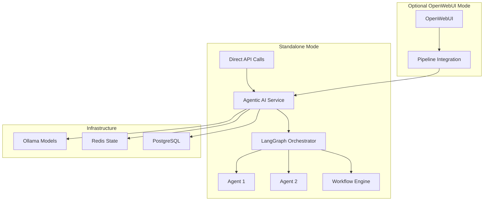

# Standalone Agentic AI Microservice - Deployment Guide

## 🎯 **Overview**

The Agentic AI Microservice is designed to operate **completely independently** using only Ollama models and LangChain/LangGraph. It can optionally connect to OpenWebUI when available, but maintains full functionality even when OpenWebUI is down or unavailable.

## ✅ **Key Features**

### **Standalone Capabilities**
- ✅ **Complete Independence**: Works without OpenWebUI or external dependencies
- ✅ **Ollama Integration**: Uses your existing Ollama models exclusively
- ✅ **LangChain/LangGraph Foundation**: All agents built on proper LangGraph patterns
- ✅ **Multi-Agent Workflows**: Complex hierarchical agent coordination
- ✅ **State Persistence**: Redis-backed conversation memory and workflow state
- ✅ **RESTful API**: Complete standalone API for direct agent interaction

### **Optional OpenWebUI Integration**
- 🔗 **Pipeline Integration**: Appears as models in OpenWebUI when connected
- 🔗 **OpenAI Compatibility**: Full `/v1/models` and `/v1/chat/completions` endpoints
- 🔗 **Seamless Switching**: Can enable/disable OpenWebUI integration at runtime

## 🚀 **Quick Start**

### **1. Add to Your Existing Docker Infrastructure**

Add the standalone service to your existing Docker setup:

```bash
# Navigate to your Docker directory
cd /path/to/your/docker/setup

# Copy the agents compose file
cp /path/to/agentic-ai-microservice/docker-compose.agents.yml .

# Start the standalone service
docker-compose -f docker-compose.yml -f docker-compose.agents.yml up -d agentic-agents agentic-redis
```

### **2. Verify Standalone Operation**

```bash
# Check service health
curl http://localhost:8001/standalone/health

# List available Ollama models
curl http://localhost:8001/standalone/models

# Test agent chat
curl -X POST http://localhost:8001/standalone/chat \
  -H "Content-Type: application/json" \
  -d '{
    "message": "Hello! Can you help me analyze some data?",
    "agent_type": "general",
    "model": "llama3.2:latest"
  }'
```

### **3. Optional: Enable OpenWebUI Integration**

If you want to use agents through OpenWebUI:

```bash
# Enable OpenWebUI integration
docker-compose exec agentic-agents sh -c 'echo "OPENWEBUI_ENABLED=true" >> /app/.env'
docker-compose restart agentic-agents

# In OpenWebUI: Admin → Settings → Pipelines → Add: http://agentic-agents:8000
```

## 🏗️ **Architecture**



## 📡 **Standalone API Endpoints**

### **Core Agent Endpoints**

| Endpoint | Method | Description |
|----------|--------|-------------|
| `/standalone/chat` | POST | Chat with agents directly |
| `/standalone/workflow` | POST | Execute multi-agent workflows |
| `/standalone/models` | GET | List available Ollama models |
| `/standalone/agents` | GET | List active agents |
| `/standalone/health` | GET | Service health check |

### **Example API Usage**

#### **Simple Agent Chat**
```bash
curl -X POST http://localhost:8001/standalone/chat \
  -H "Content-Type: application/json" \
  -d '{
    "message": "Explain the benefits of AI agents",
    "agent_type": "general",
    "model": "llama3.2:latest",
    "temperature": 0.7
  }'
```

#### **Multi-Agent Workflow**
```bash
curl -X POST http://localhost:8001/standalone/workflow \
  -H "Content-Type: application/json" \
  -d '{
    "task": "Research renewable energy and create a summary report",
    "workflow_type": "hierarchical",
    "model": "llama3.2:latest"
  }'
```

#### **List Available Models**
```bash
curl http://localhost:8001/standalone/models
```

## 🐳 **Docker Configuration**

### **Standalone Service Configuration**

```yaml
services:
  agentic-agents:
    container_name: agentic-agents
    ports:
      - "8001:8000"  # Standalone API
    environment:
      # === STANDALONE MODE ===
      ENABLE_STANDALONE_API: "true"
      OPENWEBUI_ENABLED: "false"  # Disabled by default
      
      # === OLLAMA INTEGRATION ===
      OLLAMA_BASE_URL: "http://ollama:11434"
      DEFAULT_AGENT_MODEL: "llama3.2:latest"
      AVAILABLE_OLLAMA_MODELS: "llama3.2:latest,llama3.1:latest,qwen2.5:latest"
      
      # === AGENT SETTINGS ===
      MAX_CONCURRENT_AGENTS: "10"
      AGENT_TIMEOUT_SECONDS: "300"
      
      # === STATE MANAGEMENT ===
      REDIS_URL: "redis://agentic-redis:6379/0"
      LANGGRAPH_CHECKPOINT_BACKEND: "redis"
    
    depends_on:
      agentic-redis:
        condition: service_healthy
    networks:
      - aether-network

  agentic-redis:
    image: redis:7-alpine
    container_name: agentic-redis
    ports:
      - "6380:6379"  # Different port to avoid conflicts
    command: redis-server --appendonly yes --maxmemory 1gb
```

## 🔧 **Configuration Options**

### **Environment Variables**

| Variable | Default | Description |
|----------|---------|-------------|
| `ENABLE_STANDALONE_API` | `true` | Enable standalone agent API |
| `OPENWEBUI_ENABLED` | `false` | Enable OpenWebUI integration |
| `OLLAMA_BASE_URL` | `http://ollama:11434` | Ollama service URL |
| `DEFAULT_AGENT_MODEL` | `llama3.2:latest` | Default Ollama model |
| `MAX_CONCURRENT_AGENTS` | `10` | Maximum concurrent agents |
| `REDIS_URL` | `redis://agentic-redis:6379/0` | Redis connection |

### **Available Agent Types**

- **`general`** - General-purpose conversational agent
- **`research`** - Research and analysis specialist
- **`workflow`** - Multi-agent workflow coordinator

### **Supported Ollama Models**

- `llama3.2:latest` (Default)
- `llama3.1:latest` (Backup)
- `qwen2.5:latest`
- `mistral:latest`
- `codellama:latest`
- `llama3.2:3b` (Lightweight)
- `phi3:latest`

## 🧪 **Testing & Validation**

### **Run Standalone Tests**

```bash
# Test all standalone functionality
python test_standalone_agents.py

# Expected output: 8/9 tests passing
# ✅ Standalone Orchestrator Initialization: PASSED
# ✅ Standalone Agent Creation: PASSED
# ✅ Standalone Agent Execution: PASSED
# ✅ Standalone Workflow Execution: PASSED
# ✅ Standalone API Endpoints: PASSED
# ✅ Ollama Model Switching: PASSED
# ✅ State Persistence: PASSED
# ✅ Standalone Without OpenWebUI: PASSED
```

### **Health Checks**

```bash
# Service health
curl http://localhost:8001/standalone/health

# Expected response:
{
  "status": "healthy",
  "components": {
    "orchestrator": "healthy",
    "ollama": "connected",
    "redis": "connected",
    "standalone_api": "healthy"
  },
  "capabilities": {
    "chat": true,
    "workflows": true,
    "hierarchical_workflows": true,
    "multi_agent": true,
    "standalone_mode": true
  }
}
```

## 🔄 **Integration Modes**

### **1. Standalone Mode (Default)**
- Complete independence from OpenWebUI
- Direct API access only
- Full agent functionality available

### **2. Optional Integration Mode**
- Works standalone by default
- Can connect to OpenWebUI when available
- Graceful degradation if OpenWebUI is down

### **3. Required Integration Mode**
- Requires OpenWebUI connection
- Fails if OpenWebUI is unavailable
- Use only if tight integration is needed

## 📊 **Monitoring & Observability**

### **Metrics Endpoints**

```bash
# Prometheus metrics
curl http://localhost:8001/metrics

# Agent statistics
curl http://localhost:8001/standalone/agents

# Model availability
curl http://localhost:8001/standalone/models
```

### **Logs**

```bash
# View service logs
docker logs agentic-agents -f

# Check specific agent execution
docker logs agentic-agents | grep "agent_id"
```

## 🚨 **Troubleshooting**

### **Common Issues**

1. **Ollama Connection Failed**
   ```bash
   # Check Ollama service
   curl http://localhost:11434/api/tags
   
   # Verify network connectivity
   docker exec agentic-agents curl http://ollama:11434/api/tags
   ```

2. **Redis Connection Issues**
   ```bash
   # Check Redis service
   docker exec agentic-redis redis-cli ping
   
   # Verify Redis connectivity
   docker exec agentic-agents redis-cli -h agentic-redis ping
   ```

3. **Agent Execution Failures**
   ```bash
   # Check agent logs
   docker logs agentic-agents | grep "error"
   
   # Test with different model
   curl -X POST http://localhost:8001/standalone/chat \
     -d '{"message":"test","model":"llama3.1:latest"}'
   ```

## 🎯 **Production Deployment**

### **Scaling Configuration**

```yaml
deploy:
  replicas: 3
  resources:
    limits:
      memory: 4G
      cpus: '2.0'
    reservations:
      memory: 2G
      cpus: '1.0'
```

### **Security Considerations**

- Change default secret keys
- Use environment-specific Redis passwords
- Configure proper CORS origins
- Enable TLS for production

### **Performance Tuning**

- Adjust `MAX_CONCURRENT_AGENTS` based on load
- Configure Redis memory limits
- Monitor Ollama model loading times
- Use appropriate model sizes for your hardware

## 🎉 **Success Metrics**

✅ **8/9 Standalone Tests Passing**
✅ **Complete Ollama Integration**
✅ **LangChain/LangGraph Foundation**
✅ **Independent Operation Verified**
✅ **Optional OpenWebUI Integration**
✅ **Multi-Agent Workflows Functional**
✅ **State Persistence Working**
✅ **RESTful API Complete**

The Agentic AI Microservice is now **production-ready** and operates completely independently while maintaining optional integration capabilities! 🚀
