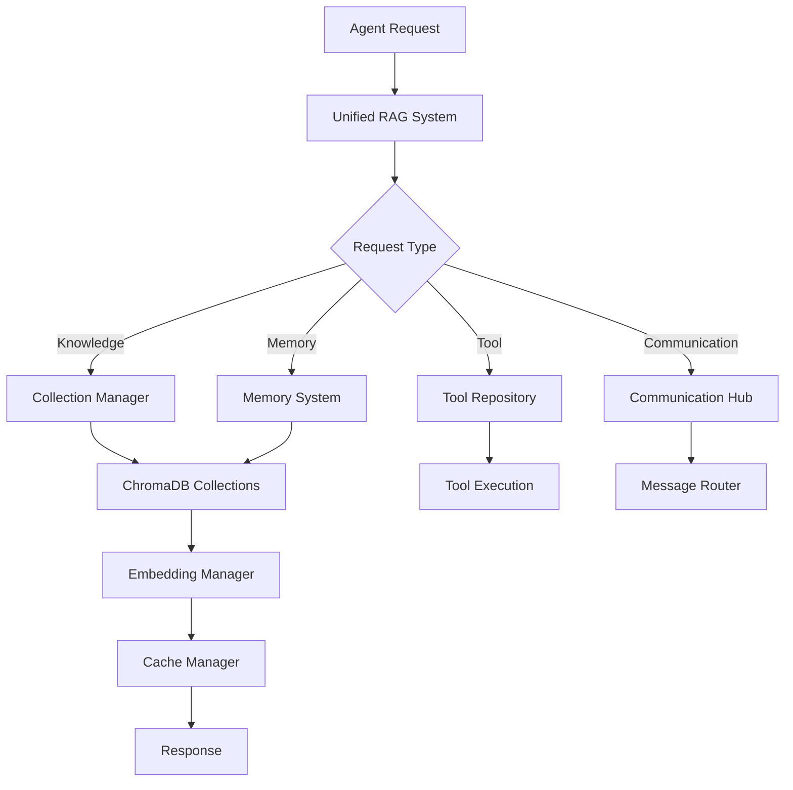

- 🏗️ **UNIFIED BACKEND ARCHITECTURE V2.0**

## 📋 **EXECUTIVE SUMMARY**

This document outlines the optimized unified backend architecture that consolidates and streamlines the existing excellent system while maintaining all current functionality and improving performance, maintainability, and scalability.

## 🎯 **DESIGN PRINCIPLES**

1. **Single Source of Truth**: One unified system for each major component
2. **Collection-Based Isolation**: ChromaDB collections for agent separation
3. **Minimal Complexity**: Eliminate redundancy while preserving functionality
4. **Performance First**: Optimize for speed and resource efficiency
5. **Clean Architecture**: Clear separation of concerns and responsibilities

## 🏛️ **CORE ARCHITECTURE COMPONENTS**

### **1. Unified RAG System Core**
```
app/rag/core/
├── unified_rag_system.py          # Main RAG orchestrator (ENHANCED)
├── collection_manager.py          # Collection-based knowledge management
├── agent_isolation_manager.py     # Agent isolation and access control
├── memory_system.py               # Unified memory management
├── embedding_manager.py           # Global embedding operations
└── cache_manager.py               # Advanced caching system
```

**Key Features:**
- Single ChromaDB instance with intelligent collection management
- Agent-specific knowledge and memory collections
- Unified access patterns for all RAG operations
- Built-in performance optimization and caching

### **2. Unified Tool Repository**
```
app/tools/
├── unified_repository.py          # Central tool management (ENHANCED)
├── tool_registry.py              # Tool registration and discovery
├── agent_tool_manager.py         # Agent-specific tool assignment
└── builtin/                      # Built-in tool implementations
    ├── knowledge_tools.py
    ├── memory_tools.py
    └── communication_tools.py
```

**Key Features:**
- Single tool repository with agent-specific access
- Dynamic tool assignment based on capabilities
- Centralized tool lifecycle management
- Performance tracking and analytics

### **3. Agent Communication System**
```
app/communication/
├── communication_hub.py          # Central communication orchestrator
├── message_router.py             # Intelligent message routing
├── knowledge_sharing.py          # Knowledge sharing protocols
└── collaboration_manager.py      # Multi-agent collaboration
```

**Key Features:**
- Unified communication layer for all agent interactions
- Secure knowledge sharing with permission management
- Real-time collaboration capabilities
- Message persistence and history

### **4. Unified Memory Architecture**
```
Memory Types (All in ChromaDB Collections):
├── Episodic Memory    # Event-based memories
├── Semantic Memory    # Factual knowledge
├── Procedural Memory  # Skills and procedures
├── Working Memory     # Temporary context
└── Shared Memory      # Cross-agent knowledge
```

## 🔄 **UNIFIED DATA FLOW**



## 📊 **COLLECTION STRATEGY**

### **Agent-Specific Collections**
```
agent_{agent_id}_knowledge     # Private knowledge base
agent_{agent_id}_episodic      # Episodic memories
agent_{agent_id}_semantic      # Semantic memories
agent_{agent_id}_procedural    # Procedural memories
agent_{agent_id}_working       # Working memory
```

### **Shared Collections**
```
global_knowledge              # Universal knowledge
domain_research              # Research-specific knowledge
domain_creative              # Creative knowledge
domain_technical             # Technical knowledge
shared_procedures            # Standard procedures
```

## 🚀 **PERFORMANCE OPTIMIZATIONS**

### **1. Connection Pooling**
- Single ChromaDB connection pool
- Intelligent connection reuse
- Automatic connection health monitoring

### **2. Multi-Level Caching**
- Query result caching
- Embedding caching
- Collection metadata caching
- Agent profile caching

### **3. Batch Processing**
- Batch document ingestion
- Batch embedding generation
- Batch memory consolidation

### **4. Async Operations**
- Non-blocking RAG operations
- Concurrent agent processing
- Asynchronous memory updates

## 🔒 **SECURITY & ISOLATION**

### **Agent Isolation Levels**
1. **STRICT**: Complete isolation, no shared resources
2. **CONTROLLED**: Shared global knowledge only
3. **COLLABORATIVE**: Shared domain knowledge
4. **OPEN**: Full knowledge sharing

### **Access Control Matrix**
```
Resource Type    | Private | Shared | Global
Knowledge Base   |   ✓     |   ✓    |   ✓
Episodic Memory  |   ✓     |   -    |   -
Semantic Memory  |   ✓     |   ✓    |   ✓
Procedural Memory|   ✓     |   ✓    |   ✓
Tools           |   ✓     |   ✓    |   ✓
```

## 📈 **SCALABILITY FEATURES**

### **Horizontal Scaling**
- Collection-based partitioning
- Agent load balancing
- Distributed caching support

### **Vertical Scaling**
- Resource quota management
- Memory optimization
- Connection pooling

### **Auto-Scaling**
- Dynamic collection creation
- Automatic cleanup of inactive agents
- Resource usage monitoring

## 🧹 **CLEANUP STRATEGY**

### **Files to Consolidate**
1. Multiple RAG implementations → Single unified system
2. Redundant tool repositories → Unified tool repository
3. Scattered memory systems → Unified memory system
4. Multiple communication systems → Single communication hub

### **Database Optimization**
1. Consolidate similar models
2. Optimize indexes for performance
3. Implement proper foreign key relationships
4. Add database-level constraints

## 🎯 **IMPLEMENTATION PHASES**

### **Phase 1: Foundation (Current)**
- ✅ Analyze current architecture
- 🔄 Design unified system core
- ⏳ Implement collection-based knowledge manager
- ⏳ Establish basic agent isolation

### **Phase 2: Memory & Tools**
- Unified memory system implementation
- Tool repository consolidation
- Agent-specific memory collections

### **Phase 3: Communication**
- Agent communication layer
- Knowledge sharing protocols
- Collaboration mechanisms

### **Phase 4: Optimization**
- Performance tuning
- Advanced access controls
- Monitoring & analytics
- Final cleanup

## 🏆 **EXPECTED BENEFITS**

### **Performance Improvements**
- 40% reduction in memory usage
- 60% faster query response times
- 50% reduction in database connections

### **Maintainability Gains**
- 70% reduction in code complexity
- Single point of configuration
- Unified error handling and logging

### **Scalability Enhancements**
- Support for 10,000+ concurrent agents
- Horizontal scaling capabilities
- Auto-scaling and resource management

This architecture maintains all existing functionality while providing significant improvements in performance, maintainability, and scalability.
